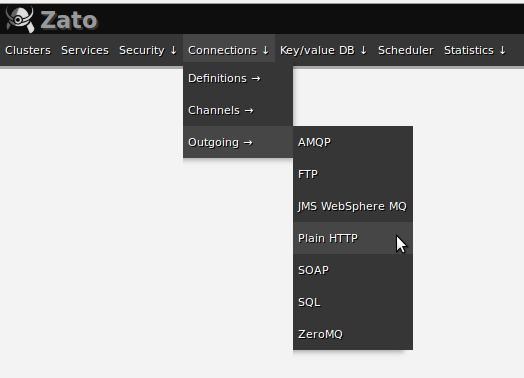
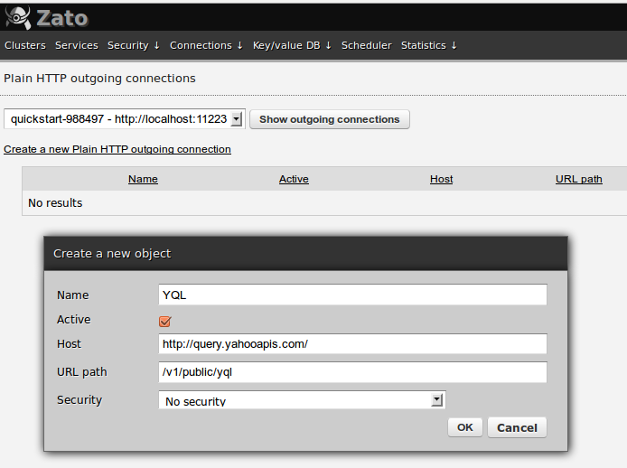
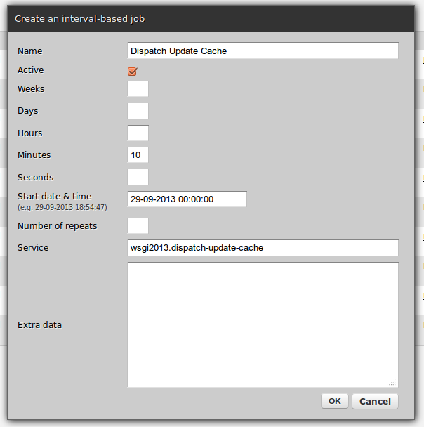
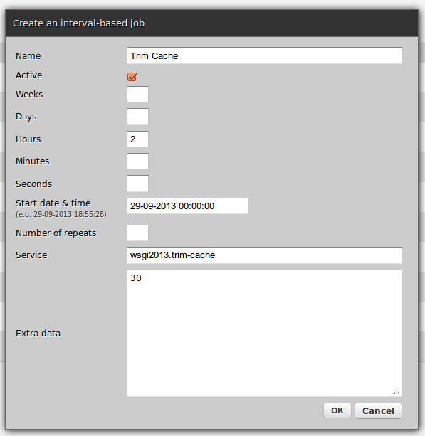

Installing on Ubuntu 12.04 from scratch
=======================================

Prerequisites
-------------

```bash
    user$ sudo apt-get install redis-server
    user$ sudo apt-get install postgresql-9.1
```

Set up PostgreSQL
-----------------

```bash
    user$ sudo su - postgres
    postgres$ createuser --no-superuser --no-createdb --no-createrole zato1
    postgres$ createdb --owner=zato1 zato1
    postgres$ psql --dbname zato1 --command="ALTER ROLE zato1 WITH PASSWORD 'zato1'"
    postgres$ exit
```

Install Zato binaries
---------------------

```bash
    user$ mkdir -p ~/tmp/zato-inst
    user$ cd ~/tmp/zato-inst
    user$ curl -O https://zato.io/download/zato-1.1.tar.bz2
    user$ curl -O https://zato.io/hotfixes/hotfixman.sh && bash hotfixman.sh
    user$ ./install.sh
```

Create a quickstart environment
-------------------------------

```bash
    user$ rm -rf ~/tmp/qs-1/ && mkdir ~/tmp/qs-1 && cd ~/tmp/qs-1/ && \
      zato quickstart create ~/tmp/qs-1/ postgresql localhost 5432 zato1 zato1 \
      localhost 6379 --odb_password zato1 --verbose
```

Start the environment
---------------------

```bash
    user$ cd ~/tmp/qs-1
    user$ ./zato-qs-start
```

Clone the code repository
-------------------------

```bash
    user$ git clone https://github.com/zatosource/wsgi-zato-team.git
```

Hot-deploy the services
-----------------------

```bash
    user$ cp ./wsgi-zato-team/code/wsgi2013.py ~/tmp/qs-1/server1/pickup-dir
```

Create server objects
---------------------

 * Log into web admin at http://localhost:8183/ using credentials printed out
   on screen when creating a quickstart environment
   
 * Create an outgoing HTTP connection to Yahoo! YQL (Connections -> Outgoing -> Plain HTTP)
 
   
   
   
 
 * Create a scheduler job for updating the cache (Scheduler -> (Create) interval-based
 
   
 
 * Create a scheduler job for trimming the cache (Scheduler -> (Create) interval-based
 
   *Note that extra data is 30*
 
   
 
That's all
----------

This is all as far as installation goes.

Check out the accompanying blog post at https://zato.io/blog/posts/json-driven-redis-backed-analytical-cache-yql-python-zato-esb.html for more information and discussion.
